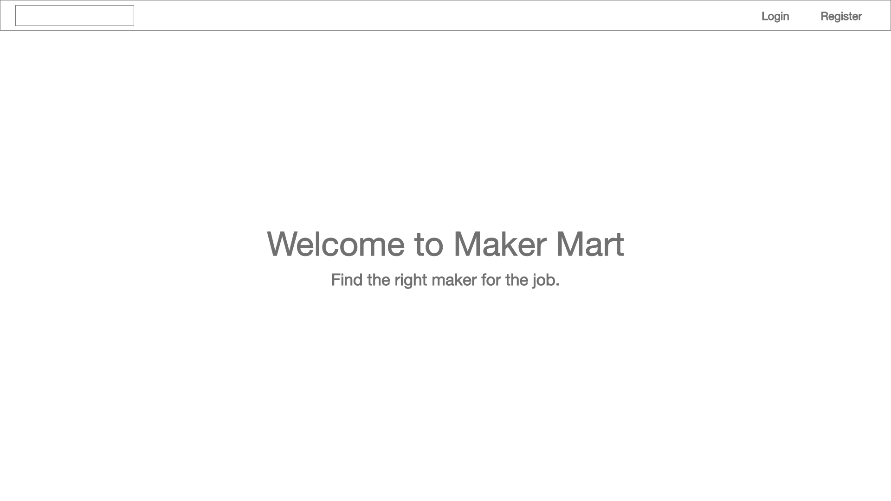
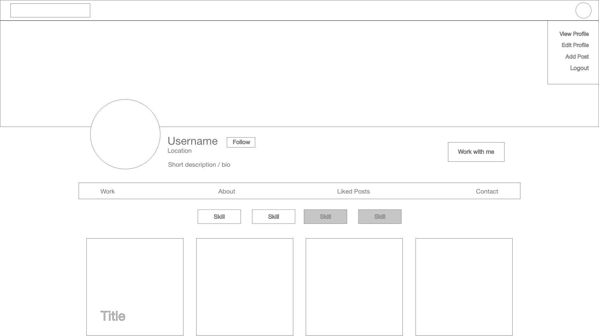
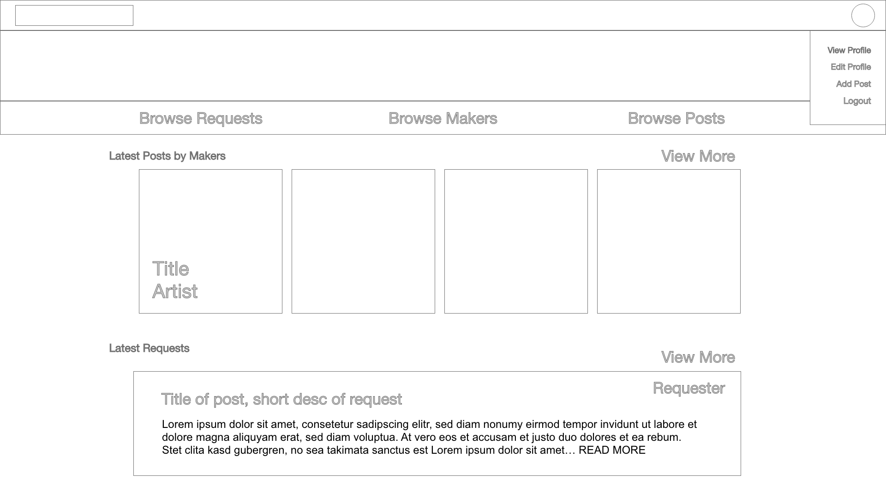
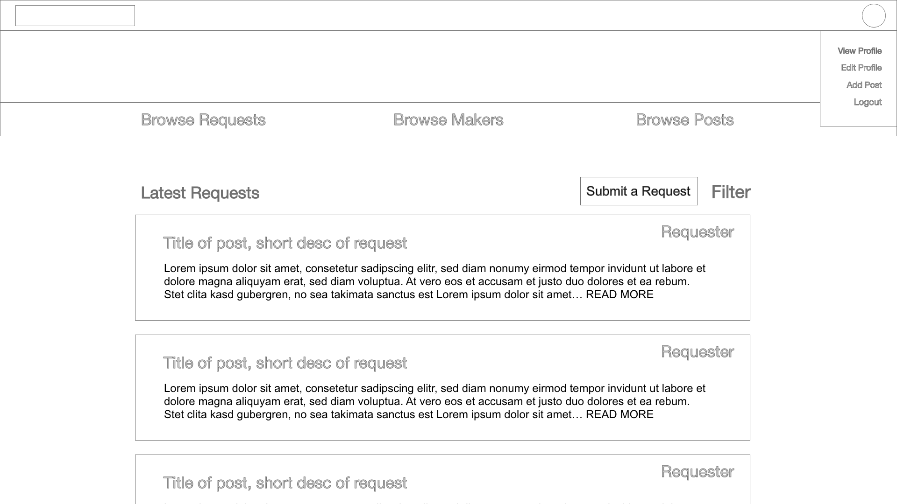

# Maker Market
Welcome to Maker Market. A place where you can find the right artist for the job. As an artist, I have always found it hard to connect with people that are interested in my art. I have always wanted to create not only a place for artists to showcase their skills, but also for anyone looking to hire an artist, or sumbit a request for work that artists with the right skills can apply to. 

#### Technologies
* React
* Material UI
* Express
* Node
* MongoDB/Mongoose
* Multer

#### to Run locally

1. Clone this repo and also the [back-end found here](https://github.com/ldbean/maker-market-backend)
1. Run `npm install` to install the dependancies in the root folders of both front-end and back-end repos
1. Run `npm start` from the front-end 
1. Run `nodemon` from the backend
1. Enjoy!

#### User Stories
1. Users can view the homepage at '/'
1. Users can login or register for an account
1. Users can see their own profile once logged in and at '/profile'
1. Users can create posts that only display on their profile that include an uploaded image
1. Users can update and delete posts from their profile only
1. Users can see all the posts from other users at the '/discover' page

### Wireframes
#### Home Page

#### Profile

#### Discover

#### Requests

### Known Issues
* Discover Page shows no posts